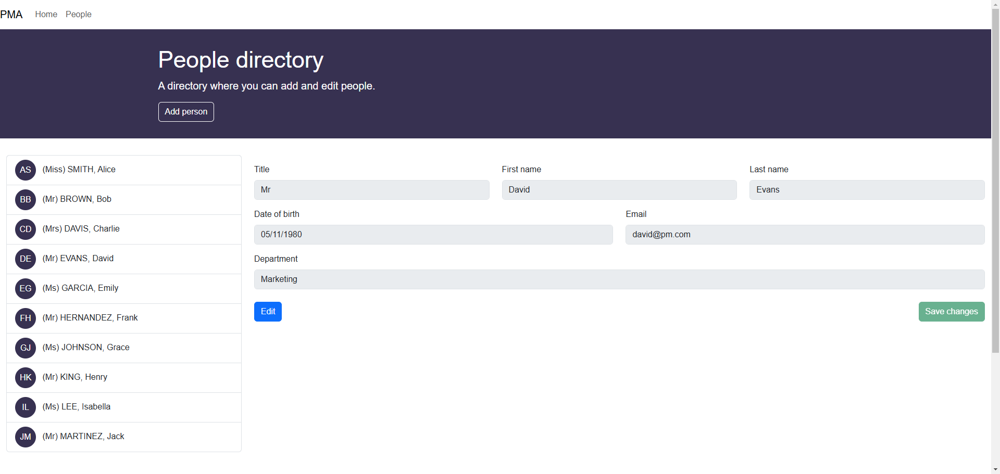

# UK Parliament - Product Team Home Exercise for Senior Developer

## Dependencies
Please ensure you have the following installed:
* .NET 8 SDK (you may need to ensure your Visual Studio installation is fully up to date)
* Node v20.16.0 LTS

## Introduction

Thanks for doing our recruitment home exercise. We have written a template solution for you, to save you from having to do too much setup.

* Clone this repository, and open the solution
* Set **UKParliament.CodeTest.Web** as the startup project
* Build and run it (NPM should install all the dependencies automatically)
* Instructions have been provided for you within the solution and these will display on the home page. The home page also shows the assessment criteria for the test. **You should aim to satisfy all points on it.**

## Submitting your test
* After you have complete this test please host your solution on GitHub (or another git based hosting platform)
* Provide us with a link so we can clone your solution

## Notes
I've created a small person manager application that has basic functionality to add, edit and view persons. The application is pretty responsive. Having had more time, I would have enhanced the application with more features like deleting a person, search, pagination, and more. I also would have ensured that the left hand panel list of persons was reactive upon changing the data in the right hand panel. I would have also added more unit tests to the application. I would have also liked to enhanced both UI and logging in the backend too. I kept in the home component as utilised it as the first page a user will come on to, added a page not found component and then a few related ones in regards to persons/people.

I've also added a few screenshots of the application in action below:

Home:

Read-only mode:

Edit mode:

Updated person:

Validation error:

Page not found:
